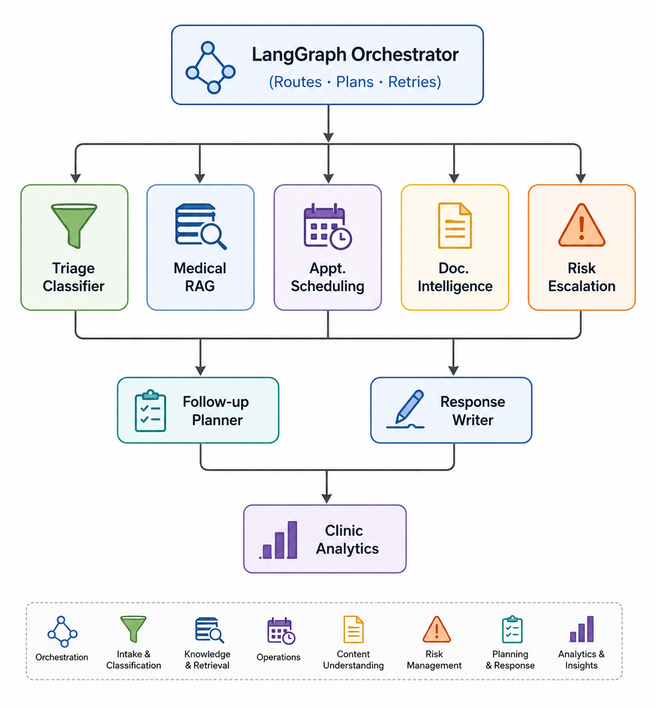

# HelixOps

### AI-Native Healthcare Operations Platform

**HelixOps** automates clinic workflows through a multi-agent AI orchestration system — handling patient communication, appointment scheduling, document intelligence, follow-up automation, and risk escalation through specialized agents coordinated by a centralized LangGraph engine.

---

## Overview

**HelixOps** is a production-oriented, multi-agent AI platform built to automate the operational workflows of modern healthcare clinics. It is not a chatbot or a medical diagnosis tool — it is an **operational intelligence layer** that coordinates specialized AI agents to handle the administrative and communicative burden placed on clinic staff.

The system is built around three principles:

- **AI assists. Doctors decide.** No agent makes autonomous clinical decisions. All clinical actions require doctor approval.

- **Orchestration over monoliths.** Eight specialized agents, each with a single domain of responsibility, coordinated by a central LangGraph state machine.

- **Event-driven by design.** Every major action — an appointment confirmed, a document uploaded, a risk flag raised — triggers a downstream workflow automatically.

---

## Problem Statement

Clinics operating at scale face a consistent set of operational bottlenecks that are not fundamentally clinical problems — they are coordination and communication problems:

| Pain Point | Impact |
|---|---|
| Manual appointment coordination via phone | Staff overload and booking errors |
| No automated follow-up sequences | Patients miss medication and care instructions |
| Unstructured lab reports and PDFs | Doctors spend time manually parsing documents |
| Delayed escalation of critical results | Risk of missed urgent findings |
| Fragmented patient communication channels | No unified conversation context |
| Zero operational visibility for admins | No aggregate view of workloads or bottlenecks |

**HelixOps** addresses each of these with a dedicated agent backed by the appropriate tools, data sources, and integrations — coordinated by a central orchestrator that routes, plans, and tracks every workflow.

---

## Multi-Agent Orchestration Model

---

## Agent Responsibilities

### Triage & Intent Classifier
Entry point for all incoming patient communication. Classifies intent (`APPOINTMENT_REQUEST`, `MEDICAL_QUERY`, `LAB_REPORT_UPLOAD`, `EMERGENCY_SIGNAL`, and more), extracts structured entities, and builds the routing payload for the orchestrator. A deterministic keyword scan for emergency signals runs before any LLM call to ensure zero latency on critical paths.

### Medical Knowledge RAG Agent
Answers clinic-specific questions by retrieving relevant context from a Pinecone-indexed knowledge base filtered strictly by `clinic_id`. Enforces citation grounding — every response must be traceable to a source document. Returns a structured fallback if no relevant context is found rather than hallucinating.

### Appointment Scheduling Agent
Manages the full appointment lifecycle: slot discovery, booking, rescheduling, cancellation, and waitlist enrollment. Integrates with Google Calendar API and a PostgreSQL slots table. Emits a `APPOINTMENT_CONFIRMED` event on successful booking to trigger the Follow-up Planner.

### Document Intelligence Agent
Processes uploaded healthcare documents through a multi-stage pipeline: PDF text extraction (PyMuPDF) or scanned document OCR (GPT-4o Vision), structured value parsing, abnormal value detection, and dual summary generation (patient-friendly and clinical). Emits a `RISK_FLAG` event when critical lab values are detected.

### Follow-up & Reminder Agent
An asynchronous, event-triggered agent that schedules and dispatches patient communication sequences. Generates timed Celery jobs for pre-appointment reminders, post-visit check-ins, and chronic care follow-ups. Clinical follow-up content requires doctor approval before dispatch.

### Risk Escalation Agent
A real-time safety monitor that runs concurrently with all patient-facing chains. Uses a two-pass detection model: a fast deterministic keyword taxonomy for immediate flagging, followed by an LLM-based contextual pass for validation. On detection: pushes a real-time alert to the doctor dashboard, returns emergency contact information to the patient, creates an immutable escalation record, and pauses all automated workflows for the patient session. Tuned toward false positives by design.

### Response Writer Agent
Converts structured agent outputs into coherent, patient-appropriate communication. Handles tone adaptation (empathetic for patients, clinical for doctors), language simplification, multilingual rendering (English, Hindi, Punjabi), and mandatory disclaimer enforcement.

### Clinic Analytics Agent  
Provides aggregate operational metrics to clinic administrators: appointment volume trends, no-show rates, escalation frequency, intent distribution, and agent response time benchmarks.

---
## Under Development ...